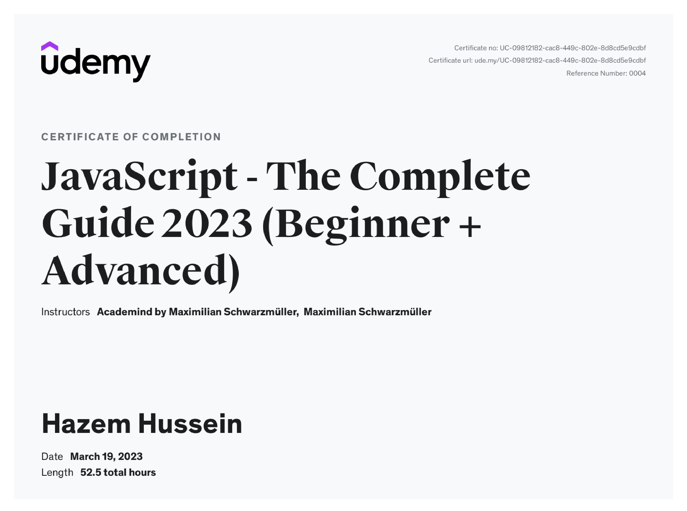

# JavaScript - The Complete Guide 2023 (Beginner + Advanced)

---

## Projects

### Calculator (S6)

- [Project Code](./Projects/01-Calculator/)
- [Live Demo](https://calculator-js-165.netlify.app/)

### Favorite Movies (S7)

- [Project Code](./Projects/02-Favorite-Movies/)
- [Live Demo](https://favorite-movies-js.netlify.app/)

### Mini Shop (S10)

- [Project Code](./Projects/03-Mini-Shop/)
- [Live Demo](https://mini-shop-0-js.netlify.app/)

### Project Planner (S14)

- [Project Code](./Projects/04-Project-Planner/)
- [Live Demo](https://project-planner-js.netlify.app/)

### Posts (S19)

- [Project Code](./Projects/05-Posts/)
- [Live Demo](https://posts-v-js.netlify.app/)

### Map (S29)

- [Project Code](./Projects/06-Map/)
- [Live Demo](https://share-place-js.netlify.app/)

---

## Code

- [Code](Code)
- [Assignments](Code/assignments/)

---

[Course-Link](https://www.udemy.com/course/javascript-the-complete-guide-2020-beginner-advanced/) 

 