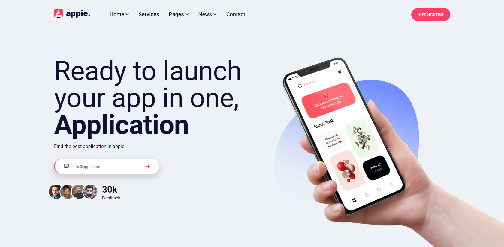

# Kalbonian Almarsos - HTML/CSS Skills Test Project
This project is created by Kalbonian Almarsos company, it aims to test your HTML and CSS skills by building a responsive website.

## Live Demo
You can view a live demo of the website at this link: [Live Demo](https://hazemhussein14.github.io/Kalbonian-phase-1/)

## Prerequisites
You will need to have a basic understanding of HTML5 and CSS3, as well as CSS flexbox and CSS grid.

 ## Technologies Used
This project uses the following technologies:

- HTML5
- CSS3
- CSS Flexbox
- CSS Grid

## GitHub Repository
The project's code can be found on GitHub at this link: [Repo](https://github.com/HazemHussein14/Kalbonian-phase-1)

## Contributors
 Hazem Hussein - [linkedin account](https://www.linkedin.com/in/hazem-hussein/)

### Contribution
Feel free to send your pull requests if you want to contribute to this project.

## About kalbonian Almarsos
More about [kalbonian Almarsos](https://www.albonyanalmarsos.org/)
